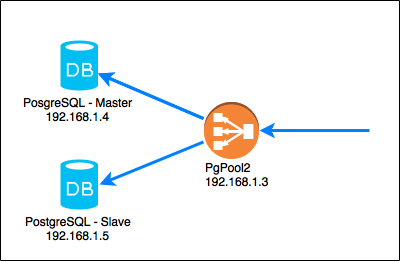

# Connection Pooling

Connection pooling provides a mechanism to reuse the existing connection
processes once the client logs off. This lowers connection overhead on
the postmaster, improves application db access performance and spreads
connection cost over repeated clients. Normally, connection processes
are destroyed once the client logs off.

## pgpool-II

An OS tool that acts as middleware between Postgres servers and a PG db
client. Communicates to PG backend and frontend protocol, and relays a
connection between them. It saves connections to the PG server and
reuses them whenever a new connection with the same properties
(username, database, protocol version) comes in. It provides
cluster-based connection pooling, replication and failover and load
balancing.

Example scenario; a load balancer with PgPool2 for PostgreSQL
Master-Slave replication:



**pgpool-II** can manage multiple Postgres servers, and manage replication between
servers also. If the database is replicated, executing a SELECT query on
any server will return the same result. **pgpool-II** automatically
detects SELECT and can load balance reads among multiple servers,
improving overall performance. This works best in a situation where
there are a lot of users executing many queries at the same time.

There is a limit on the max number of concurrent connections with PG and
connections are rejected after this limit is reached. **pgpool-II** also
has a limit on the max number of connections, but extra connections will
be queued instead of returning an error immediately.

**pgpool-II** automatically detects a failed master and can take action
to promote a slave to be the new master. After failover it automaticaly
redirects all write load to the new master and forgets the failed
master.

## **pgpool-II** installation and configuration

Only available on Linux-based systems with UNIX architectures.
Installation required gcc 2.9+ and GNU make. Configuration is
performed in ``pgpool.conf`` and ``pcp.conf``.

``pcp.conf`` is the user/password file for authentication with its
interface. After installation, ``pcp.conf.sample`` is created. Password
can be produced with the ``pg_md5`` command:

    $ pg_md5 -p password: <your password>

``pgpool.conf`` has configuration for operation modes. Samples are
generated after installation.

``pool_hba.conf`` can be used to implement host-based access control. By
default, ``pool_hba`` authentication is disabled, change
``enable_pool_hba`` to on to enable it. Format and usage is similar to
``pg_hba.conf``, but only trust, reject, md5 and pam for METHOD field
are supported. To use MD5 authentication, you must register username and
password in ``pool_passwd``. Users can connect directly to the database
in which case ``pg_hba.conf`` will be used.

Config guides:

* http://www.pgpool.net/docs/latest/tutorial-en.html
* https://sonnguyen.ws/replication-load-balance-in-posgresql-replication-with-pgpool2/


## pgbouncer

**pgbouncer** is a lightweight connection pooler for Postgres. It has
low memory requirements, it is a database-based pooler thus can connect
to a database from different clusters, it is not tied to one backend
server, it supports restart/upgrade without dropping client connections
and supports both Windows and Linux platforms.

**pgbouncer** supports several types of pooling when rotating
connections:

* Session pooling - a server connection is assigned to the client app for
  the life of the client connection (default).
* Transaction pooling - a server connection is assigned to the client
  app for the duration of a transaction.
* Statement pooling - a server connection is assigned to the client for
  each statement.

An application connects to **pgbouncer** as if it were a Postgres
database. It then creates a connection to the actual database server or
reuses one of the existing connections from the pool. **pgbouncer** can
be downloaded and installed using the Application Stack Builder, or
compiled from source: https://pgbouncer.github.io/install.html`

Configure using a ``pgbouncer.ini`` file, user authentication in a
``users.txt`` file. **pgbouncer** has a special management database:

```
psql -p 6543 -U someuser pgbouncer
```
