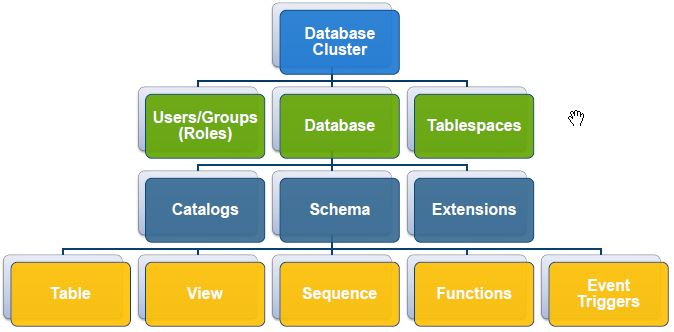

# Object hierarchy



The top-level object is the database cluster.
Databases can be owned by users or groups. Databases can use 1+
tablespaces. A database contains Catalogs/Schemas/Extensions.

# Databases

A database is a named collection of SQL objects (tables, views,
functions, etc.) It is a collection of schemas and the schemas
contain the objects.

Docs: http://www.postgresql.org/docs/9.5/static/managing-databases.html

```sql
# List databases:
\l
SELECT datname FROM pg_database;
# List users:
\du
# More details for users:
select * from pg_user;
# List tablespaces:
\db
# List schemas:
\dn
# Create/drop a database:
CREATE DATABASE name OWNER role;
DROP DATABASE name;
REVOKE CONNECT ON DATABASE name FROM public;
# Display help with syntax:
\h create database
# Connect to a database:
\c name
```

# Users

Database users are separate from OS users. Database users are global
across a db cluster. Username must be unique and requires
authentication. Every connection is made using a user. Default superuser
is **postgres** or **enterprisedb** (in Advanced Server). Default can be
changed during creation of a cluster.

```sql
# Create a user:
CREATE USER username PASSWORD 'password123' SUPERUSER;
```

# Roles

PostgreSQL manages database access permissions using the concept of
roles. A role can be thought of as either a database user, or a group of
database users, depending on how the role is set up. The concept of
roles subsumes the concepts of "users" and "groups".

Note that there is a **public** role that is granted to all users by
default. Users with the **public** role can connect to all databases.

Role docs: http://www.postgresql.org/docs/9.5/static/user-manag.html

```sql
CREATE ROLE rolename LOGIN;
ALTER ROLE rolename WITH PASSWORD 'password';
ALTER ROLE rolename WITH CREATEDB;
REVOKE CONNECT ON DATABASE sensitivedb FROM public;
```


# Privileges

Pivileges can exist at the cluster level or the object level. Granted to
a user during ``CREATE`` or later using ``ALTER USER``. Granted by a
superuser.

Object level privs are controlled using the ``GRANT`` statement. Privileges
can be granted on a tablespace, database, schema, table, function, etc.
to database users, groups or roles. Note that ``GRANT foo WITH GRANT
OPTION`` allows the user to grant the privilege.

Privs can be revoked using ``REVOKE``.

```sql
# Get help with syntax:
\h GRANT
# Change a user password.
ALTER ROLE username WITH PASSWORD 'password';
GRANT CONNECT ON DATABASE dbname TO username;
\h REVOKE
REVOKE CONNECT ON DATABASE dbname TO username;
```

# Schemas

A database contains one or more schemas, which is turn contain tables,
functions, sequences, etc. Schemas are owned by a user. By default all
databases contain a ``public`` schema. Benefits:

* Can allow many users to use one db with interfering with each other.
* To organise db objects into logical groups.
* Add 3rd-party applications to separate schema to avoid naming
  collisions.

Docs: http://www.postgresql.org/docs/9.5/static/ddl-schemas.html

```sql
CREATE SCHEMA newschema;
CREATE SCHEMA newschema AUTHORIZATION rolename;
# List schemas:
\dn
SELECT * from pg_catalog.pg_namespace;
# Create a table in the schema:
CREATE TABLE newschema.mytable;
# Display the current schema search path:
SHOW search_path;
# Set a new schema search path:
SET search_path TO newschema, public;
```
