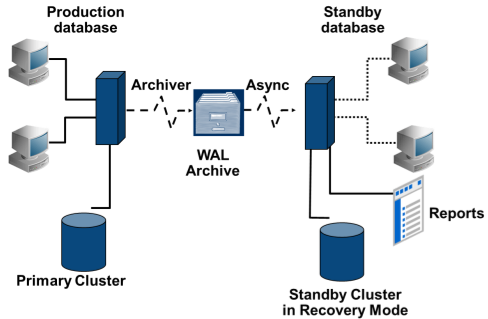
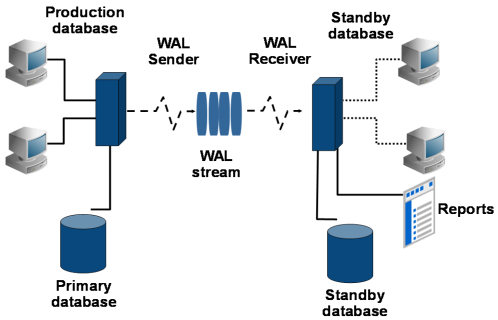

# Streaming Replication

Reference: https://wiki.postgresql.org/wiki/Streaming_Replication

## Data Replication

Replication is the process of copying data and changes to a secondary
location for safety and availability. Data Replication in PostgreSQL can
be achieved by implementing:

* Log-shipping standby servers
* Streaming replication
* xDB replication

Failover can be automated using **EDB Failover Manager** for streaming
replicated servers, of pgpool-II.

## Sync or Async

Log shipping is only synchronous. Postgres streaming replication is
async by default but can be configured as synchronous. Async:

* Disconnected architecture
* Transaction is committed on primary and flushed to WAL segment
* Later transaction is transmitted to standby server(s) using stream
* In log shipping, replication happens when the WAL segment is archived
  (some data loss is possible)

Only streaming replication supports synchronous replication method. It
is 2-safe replication; commit actions occur on primary and secondary.
Transaction is commited on prmary and flushed to WAL segment of primary
and standby server(s). User gets commit message after confirmation from
all servers (introduces a delay).

## Log-Shipping Standby Servers

WAL archiving method for HA cluster. Primary server is in WAL archive
mode. Standbys are in continuous recovery mode; reading and playing WAL
logs from the WAL archive area of the primary server. Low performance
impact on primary, low administration overhead. Supports both warm and
hot standby.

Log-shipping architecture:

## Streaming Replication

Streaming replication (hot standby) is a major feature of Postgres. The
standby connects to the primary node using ``REPLICATION`` protocol. Each
transaction commits and immediately streams across to the standby (no
log shipping delays). Also supports cascading replication, so the
standby can also send replication changes (sharing the overhead of a
master).

Hot streaming architecture:

## Cascading Replication

Streaming replication supports single master node. The ability of a
standby server to send stream or archive changes to other standby
servers is **cascading replication**. Such standby servers are called
cascading standbys. This help minimise bandwidth overheads on the master
node, but can only be asynchronous.

## Set up replication using Archive

1. WAL archive must be configured on primary server.
2. Archive location must be accessible to standby server.
3. Take a full base backup of primary db cluster.
4. Copy the backup to the standby server.
5. If using db tablespaces, directory structure must be the same on
   master and standby.
6. Create a ``recovery.conf`` file inside data dir of standby db
   cluster.
7. Turn on ``standby_mode`` and set ``restore_command`` to copy file
   from the WAL archive location.

Configure WAL archiving (Debian/Ubuntu):

    $ sudo mkdir /mnt/archive_dest
    $ sudo chown postgres:postgres /mnt/archive_dest
    $ vi /etc/postgresql/9.5/<CLUSTER_NAME>/postgresq1.conf
        wal level = hot standby
        archive mode = on
        archive command = 'cp %p /mnt/archive_dest/%f'
    $ sudo service postgresql restart

Take a base backup of primary and copy it to standby:

    $ psq1 -c "select pg_start_backup('Standby1');"
    $ cp -rp /var/lib/postgresql/9.5/<CLUSTER_NAME> standby-host:/var/lib/postgresql/9.5/<CLUSTER_STANDBY>
    $ psq1 -c "select pg_stop_backup();"
    $ rm standby-host:/var/lib/postgresql/9.5/<CLUSTER_STANDBY>/postmaster.pid

**Note**: postmaster.pid must be removed from standby and never
from the master server data directory.

On the standby, create ``recovery.conf``:

    $ vi /var/lib/postgresql/9.5/<CLUSTER_STANDBY>/recovery.conf
        standby_mode = on
        restore command = 'cp -rp /mnt/archive_dest %p'
        archive_cleanup_command = 'pg_archivecleanup /mnt/archive_dest %r'
        trigger_file = '/var/lib/postgresql/9.5/<CLUSTER_STANDBY>/create_me_for_failover_5432'

Open postgresql.conf and turn on hot standby mode:

    $ vi /var/lib/postgresql/9.5/<CLUSTER_STANDBY>/postgresgl.conf
        hot standby = on

If testing on single machine, comment archive parameters and change
port. Save and start the standby:

    $ pq_ctl —D standby1/ -l standby1/startlog start

## Set up Streaming Replication

Prepare the Primary Server:

* Change WAL level parameter (``wal_level = hot_standby``)
* Set only the minimum no. of segments retained in pg_xlog
  (``wall_keep_segments = 50``)
* Two options to allow streaming connection:
  * ``max_wal_senders`` - set max no of concurrent connections from
    standby server or stream clients. This enables the ability to stream
    WAL to the standby.
  * ``max_replication_slots`` - max no of replication slots that the
    server can support.
* ``wal_sender_timeout`` - specify time in ms to terminate inactive
  replication connections (default 60s).

Synchronous Streaming Replication set up:

* Default level of Streaming Replication is Asynchronous
* Synchronous level can also be configured to provide 2-safe replication
* Addition parameters need to be configured:
  * ``synchronous_commit = on``
  * ``synchronous_standby_names`` (specifies a comma-separated list of
  standby names that can support synchronous replication)
* Transactions can be configured not to wait for replication by setting
  the synchronous commit parameter to local or off.
* During syncronous setup ``pg_start_backup()`` and pg_stop_backup()``
  are run in a session With synchronous commit off.

Configure authentication: authentication setting on the primary server
must allow replication connections from the standby server(s). Provide a
suitable entry or entries in **pg_hba.conf** with the database field set
to ``replication``. Need to reload the primary.

Take a full backup of primary server:

* Connect to the db as a superuser and issue the command: ``SELECT
  pg_start_backup('label');``
* Perform the backup using a filesystem tool such as **tar**: ``cp -rp
  /var/lib/postgresql/9.5/<CLUSTER_NAME> /backup/data1``
* Connect to the db as a superuser and issue the command: ``SELECT
  pg_stop_backup();``
* Copy the backup directory on to the standby server (possibly change
  the port if the standby is on the same PC).

Setting up the standby server:

* Remove **postmaster.pid** file.
* Configure standby server parameters (note that ``hot_standby`` must be
  on for readonly transaction support on standby).
* Create **recovery.conf** file inside the data dir of the standby
  server.
* Set up recovery.conf params (standby_mode, primary_conninfo,
  primary_slot_name, recovery_min_apply_delay, trigger_file).
* Start the standby server.

Adding cascading Replicated Standby server:

* Backup the primary server using **pg_basebackup**: ``pg_basebackup -h
  localhost -U replication_user -p 5432 -D /backup/data2``
* A new cluster will be created with data dir "data2".
* Change the port if on the same machine.
* Create **recovery.conf** file in new standby (``standby_mode = on,
  primary_conninfo='details'``)
* Change ``pg_hba.conf`` of standby to allow conenction from data2 cluster.
* Start the cluster.

## Monitoring Hot Standby

``pg_stat_replication`` shows slaves connected to the master and other
useful information. Streaming replication can also be monitored by size
of not-yet-applied WAL records and lag time between WAL apply. Recovery
information functions:

* pg_is_in_recovery()
* pg_current_xlog_location
* pg_last_xlog_receive_location
* pg_last_xact_ replay_timestamp()

Recovery control functions:

* pg_is_xlog_replay_paused() (boolean)
* pg_xlog_replay_pause()
* pg_xlog_replay_resume()
